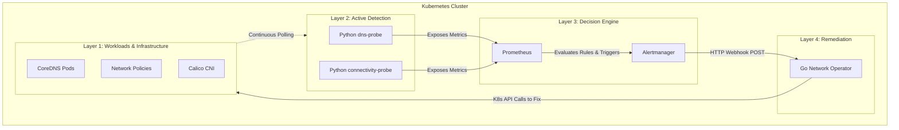

# Automated Kubernetes Network Self-Healing

This document contains the complete content, architecture diagrams, and speaker notes for the 5-slide project presentation.

---

## Slide 1: Problem Statement & Objectives

**Title: Automated Kubernetes Network Self-Healing**

### The Problem

- **Silent Failures:** Kubernetes network infrastructure issues—such as DNS outages, misconfigured network policies, or CNI plugin crashes—often occur silently without immediate pod termination.
- **Manual Bottleneck:** Traditional monitoring only triggers alerts for human operators, leading to high Mean Time To Recovery (MTTR) and prolonged service downtime.

### The Objective

- Design and implement a closed-loop, zero-touch self-healing system for Kubernetes network infrastructure.

### Key Goals

- **Active Detection:** Continuously verify cluster network health (DNS resolution & cross-namespace HTTP connectivity).
- **Automated Remediation:** Programmatically resolve faults without human intervention.
- **Real-time Observability:** Visualize the entire failure-and-recovery lifecycle in real-time.

### Speaker Notes

> "Good morning/afternoon. Our project focuses on making Kubernetes networks more resilient. In modern microservices, network issues like accidental policy blocks or DNS failures cause silent outages. Usually, an alert wakes up an engineer who manually fixes it, taking precious time. Our objective was to build an intelligent, automated closed-loop system that not only detects these failures in real-time but uses a custom Operator to automatically fix them, reducing downtime from minutes or hours to just seconds."

---

## Slide 2: Architecture / Mechanism

**Title: 4-Layer Self-Healing Architecture**

### System Architecture

### Mechanism Overview

- **Layer 1: Workloads:** 3-node KIND K8s cluster utilizing the Calico CNI.
- **Layer 2: Active Detection (Custom Probes):** Python-based `connectivity-probe` and `dns-probe` run constantly, exposing real-time success/failure metrics.
- **Layer 3: Decision Engine (Alerting):** Prometheus scrapes metrics and evaluates rules. Alertmanager buffers alerts and triggers HTTP webhooks when thresholds are breached.
- **Layer 4: Remediation (Go Operator):** Custom Go application receives webhooks and executes K8s API calls to heal the cluster (e.g., overriding bad policies, restarting CoreDNS pods).

### Speaker Notes

> "Our architecture is divided into four stages: Workloads, Detection, Decision, and Remediation. We built custom Python probes that constantly test DNS and HTTP connectivity across namespaces. When a failure occurs, Prometheus detects the metric drop and Alertmanager fires a webhook. The brain of our project is a custom Operator written in Go. It catches this webhook, identifies the exact nature of the fault, and uses K8s API calls to immediately correct the infrastructure—for example, wiping out a bad network policy."

---

## Slide 3: Extension / Issues Fixed / Evaluation

**Title: What We Built, Fixed & Evaluated**

### Key Implementations & Extensions

- **Custom Kubernetes Operator:** Built a Go-based controller that interacts directly with the Kubernetes API to execute automated remediation logic.
- **Active Probing System:** Developed custom Python metrics exporters (`dns-probe`, `connectivity-probe`) that continuously validate cluster network health rather than waiting for passive workload failures.
- **Chaos Engineering Framework:** Implemented a fault-injection pipeline to simulate real-world cluster chaos (e.g., crashing CNI plugins, applying blocking NetworkPolicies, simulating DNS death).
- **Observability Pipeline:** Configured a complete Prometheus, Alertmanager, and Grafana stack specifically tuned for network self-healing visualization.

### Critical Issues Fixed

- **Network Policy Additivity:** Programmed the Operator to dynamically strip conflicting baseline "allow" rules before applying targeted fixes, solving K8s' additive policy stacking.
- **Metric Tracking Accuracy:** Simulated true runtime crashes using `kill 1` inside containers to accurately trigger Kube-State-Metrics rather than standard pod deletion.

### Evaluation & Results

- **Closed-Loop Success:** The system successfully detects injected faults, fires alerts, remediates the cluster, and recovers to a green state without human intervention.

### Speaker Notes

> "On top of standard Kubernetes, we built several critical extensions. We wrote a custom Go Operator to act as the brain, Python probes for active monitoring, and a chaos engineering framework to test the system with real faults. During development, we fixed complex bugs like Kubernetes Network Policies stacking unexpectedly, and adjusted our fault simulation to use container kills so metrics were tracked accurately. Ultimately, evaluating the system showed complete closed-loop success—if we inject a fault, Grafana turns red, the operator automatically heals the infrastructure, and the dashboard recovers to green within a minute."

---

## Slide 4: Non-Functional Testing Parameters

**Title: Performance, Scalability & Reliability**

### Performance (Self-Healing SLA)

- **Detection to Remediation Loop:** **~55 to 65 Seconds**.
- **Timeline Breakdown:**
  - 15s (Probe interval)
  - - 15s (Prometheus "For" wait state)
  - - 10s (Alertmanager grouping buffer)
  - - 5-10s (Operator execution & K8s state convergence)
  - - 5-10s (Next probe success).

### Reliability

- **Idempotency:** The Go operator utilizes standard `client-go` K8s libraries. Operations (like applying policies or restarting pods) are safe to run multiple times without corrupting the cluster state.
- **RBAC Security:** The Operator adheres strictly to the principle of least privilege, scoped tightly via dedicated Kubernetes ClusterRoles and ServiceAccounts.

### Scalability

- **Stateless Operator:** The Go-webhook receiver holds no local state, allowing it to be scaled horizontally if webhook traffic spikes across a large cluster.
- **Metric Efficiency:** Probes are lightweight and conform to standard Kubernetes metric exposition formats, ensuring Prometheus isn't overwhelmed.

### Speaker Notes

> "For non-functional testing, our primary metric is the Service Level Agreement (SLA) for automated recovery. Our system completes the entire loop—from the moment a fault happens to the K8s cluster returning to a healthy state—in about 60 seconds. We tuned Prometheus and Alertmanager intervals specifically for this aggressive SLA. Furthermore, we designed the Go Operator to be stateless and idempotent, meaning it won't crash or corrupt the K8s database even if multiple alerts fire simultaneously. It is also strictly secured using K8s Role-Based Access Control."

---

## Slide 5: Challenges Faced

**Title: Technical Challenges & Learnings**

### Monitoring "Chicken-or-Egg" Problem

- **Challenge:** When testing complete DNS failure (CoreDNS scaling to 0), internal K8s DNS broke. Grafana could no longer resolve Prometheus's internal `.svc.cluster.local` address to populate the dashboard.
- **Learning:** True infrastructure monitoring must be decoupled from the infrastructure it monitors, relying on IP-based routing or external systems rather than internal cluster dependencies.

### Event-Driven Concurrency

- **Challenge:** Alertmanager can fire multiple webhooks for the same incident during the transition period before the cluster fully heals.
- **Learning:** Required writing robust Go code that checks the current Kubernetes API state before acting, ensuring fixes aren't blindly applied in a loop.

### Simulating True Outages

- **Challenge:** Getting Kubernetes to naturally report a container "CrashLoop" metric was difficult. Standard K8s API pod deletions completely reset the restart counter.
- **Learning:** Discovered the necessity of executing a shell kill command inside the container (`kill 1`) to simulate true runtime crashes that Kube-State-Metrics can track.

### Speaker Notes

> "The biggest challenge we faced was the 'Chicken-or-Egg' monitoring problem. We designed a fault that takes down the cluster's DNS. However, when we did this, Grafana completely broke because it used that exact same K8s DNS to find Prometheus! It taught us a vital lesson about decoupling monitoring infrastructure from the application infrastructure. We also faced challenges with event concurrency—Alertmanager firing multiple alerts while the fix was already in progress—which forced us to make our Go operator much smarter and state-aware. Overall, these challenges provided deep insights into Kubernetes internals."
